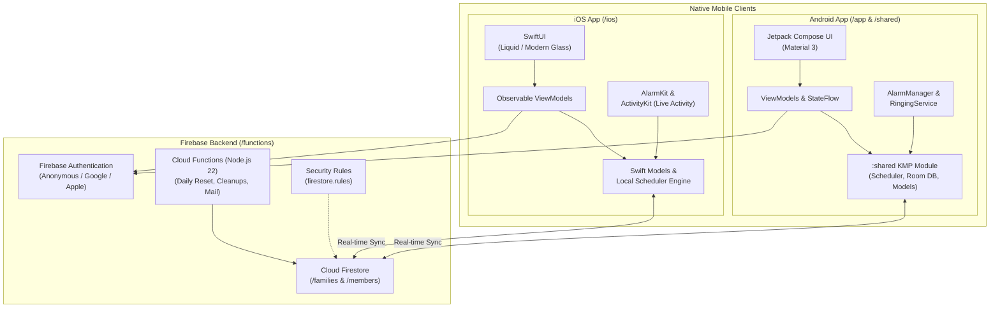
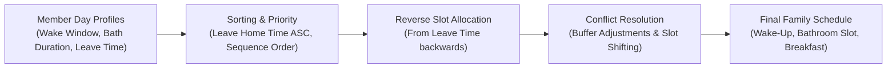

# Architecture of FamWake

FamWake is a modern family alarm and morning routine scheduler designed for iOS and Android. This document details the architectural principles, component layout, data persistence, and synchronization mechanisms used across the project.

---

## 1. Architectural Philosophy: Client-First

FamWake is built with a **Client-First & Privacy-Focused** mindset:

- **Local-First Computation:** The scheduling algorithm (calculating wake times, bathroom slots, breakfast, and buffers) runs locally on the user's device. No cloud round-trips are required to compute schedules.
- **Offline Resilience:** The application functions fully offline. Both Android and iOS cache all family data locally. When offline, users can pause/resume alarms or change day profiles. Sync occurs automatically when connectivity is restored.
- **Minimalist Backend:** Firebase Cloud Functions serve purely as infrastructure helpers (transactional email, scheduled daily resets, play integrity verification). They never make scheduling decisions.
- **Privacy by Design:** Zero tracking of personal schedules or habits. Data is scoped strictly to the authenticated family.

---

## 2. System Overview



---

## 3. Project Structure

| Directory | Platform / Technology | Purpose |
|---|---|---|
| [`/app`](app) | Kotlin, Jetpack Compose | Native Android application, receivers (`BootReceiver`, `AlarmReceiver`), services (`FamWakeTileService`). |
| [`/shared`](shared) | Kotlin Multiplatform (KMP), Room DB | Shared scheduling algorithm (`Scheduler.kt`), domain models (`FamilyModels.kt`), Room database cache, and settings. |
| [`/ios`](ios) | Swift, SwiftUI, AlarmKit | Native iOS application, Live Activities, lock screen interactions, and local persistence. |
| [`/functions`](functions) | Node.js 22, Firebase SDK v2 | Cloud Functions for background maintenance, family management (`deleteFamily`, `joinFamilyByCode`), and transactional emails. |

---

## 4. Scheduling Engine

The morning scheduling algorithm coordinates family members sharing limited bathroom facilities and optionally common breakfast times:



1. **Input:** Each member has an active `DayProfile` specifying:
   - Earliest and latest wake-up time (wake window).
   - Bathroom duration (e.g., 20 minutes).
   - Leave home time.
   - Whether they participate in common breakfast.
2. **Reverse Allocation:** Schedules are calculated backwards from the departure deadline to ensure everyone leaves on time without bathroom collisions.
3. **Puffering & Fallbacks:** Dynamic buffer reduction prevents deadlocks if family slots exceed available morning time.

---

## 5. Data Persistence & Security

### Local Storage
- **Android:**
  - **Room Database:** Caches family and member documents for instant, offline-capable UI rendering.
  - **Device-Protected Storage (`AlarmBackupPrefs`):** Unencrypted plain storage readable even in Direct Boot mode (before device unlock / PIN entry) to restore exact alarms after unexpected reboots.
  - **DataStore:** Non-blocking asynchronous preferences via `DataStoreObservableSettings`.
- **iOS:**
  - **UserDefaults & AppStorage:** Local UI settings and member identifiers.
  - **AlarmKit Framework:** Apple's official system-level framework for secure and reliable wake-up triggers.

### Cloud Firestore Schema
```
/families/{familyId}
    ├── name: string
    ├── joinCode: string (6 chars, unique)
    ├── createdByUserId: string
    ├── userIds: string[]
    └── members/{memberId}
            ├── name: string
            ├── isAwakeToday: boolean
            ├── isPaused: boolean
            ├── sequenceOrder: number
            ├── dayProfiles: map
            └── claimedByUserId: string (optional)
```

### Security Rules (`firestore.rules`)
- **Read & Write Scoping:** Access is strictly limited to authenticated users whose `uid` is present in the family's `userIds` array (`isFamilyMember()`).
- **Field-Level Protection:** Clients cannot modify immutable fields such as `createdByUserId`, `joinCode`, or `userIds` directly.
- **Safe Deletion:** Direct client deletion of families is disallowed. Deletion is routed through the `deleteFamily` Cloud Function to guarantee recursive cleanup of member subcollections and user profiles.
