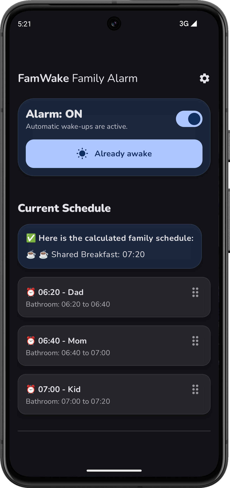
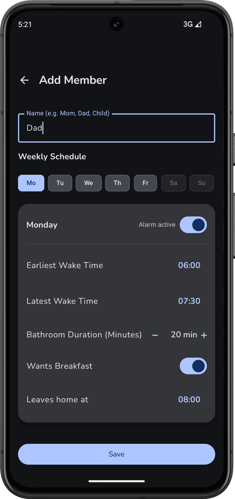
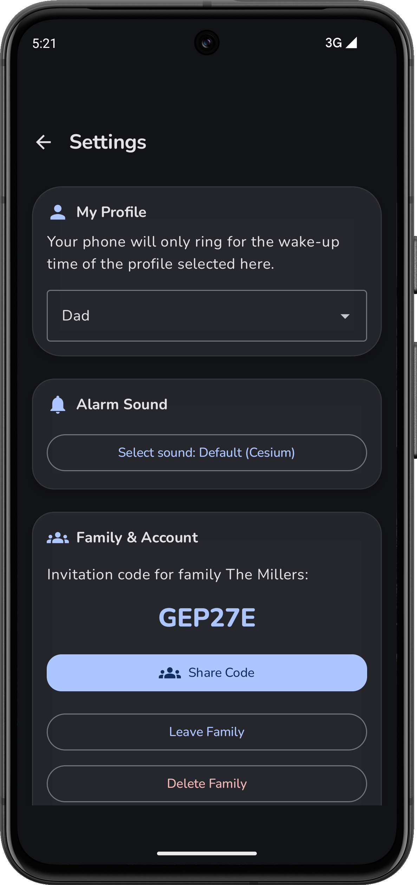

# ⏰ **FamWake** Familienwecker / Family Alarm

*[🇩🇪 Deutsche Version](README.md)*

**Everyone sleeps longer. Nobody fights over the bathroom. Start your day relaxed.**

The **FamWake Family Alarm** is the intelligent solution for a relaxed morning routine. Instead of rigid wake-up times, the app dynamically adapts to the schedules and needs of all family members.

👉 **Find all information, features, and the waitlist sign-up on our website:**  
🌐 [familienwecker.de/en](https://familienwecker.de/index-en.html)

## 📸 A Sneak Peek at the App (Dark Mode)

See how FamWake organizes your morning:

  
  &nbsp;&nbsp;&nbsp;&nbsp;
  
  &nbsp;&nbsp;&nbsp;&nbsp;
  

1.  **The Current Wake-up Plan** (`screenshot_6_main.png`): This shows the result: a calculated, stress-free morning with synchronized bathroom slots and shared breakfast.
2.  **Profile Settings** (`screenshot_5_config.png`): This displays the app's smart features, such as "Bathroom Duration" and "Wants to share breakfast."
3.  **The Invitation Code** (`screenshot_7_settings.png`): Shows how easily you can invite more people to your family group. Shared benefits for everyone!

## ✨ The Highlights

* **Maximum Sleep Time:** A clever algorithm calculates the absolutely perfect daily wake-up plan for the entire family.
* **No Bathroom Traffic Jams:** Wake-up times are intelligently coordinated so that the bathroom is always handed over seamlessly.
* **Shared Time:** The app finds the ideal slot for everyone who wants to have breakfast together.
* **Weekend Switch:** Simply pause your own alarm – meaning your bathroom slots expire so the rest of the family can sleep in even longer.
* **"Already Awake" Button:** Deactivate your alarm for today without affecting the schedule of others.
* **Secure Login:** Easy sign-in via email or Google account.

*(Find more details on features like the smart master plan, flexible wake-up logic, and dark mode on our [website](https://familienwecker.de/index-en.html).)*

---

## ⚖️ Copyright & License

Copyright (c) 2026 Daniel Notthoff. All rights reserved. 

The source code in this repository is provided for educational and review purposes only. It may not be copied, modified, or distributed without explicit permission from the author.

* [Changelog (Version History)](docs/CHANGELOG.en.md)
* [Roadmap (Planned Features)](docs/ROADMAP.en.md)
* [Privacy Policy](https://familienwecker.de/privacy-policy.html)
* [Imprint](https://familienwecker.de/imprint-en.html)
* [Account Deletion](https://familienwecker.de/account-deletion-en.html)
