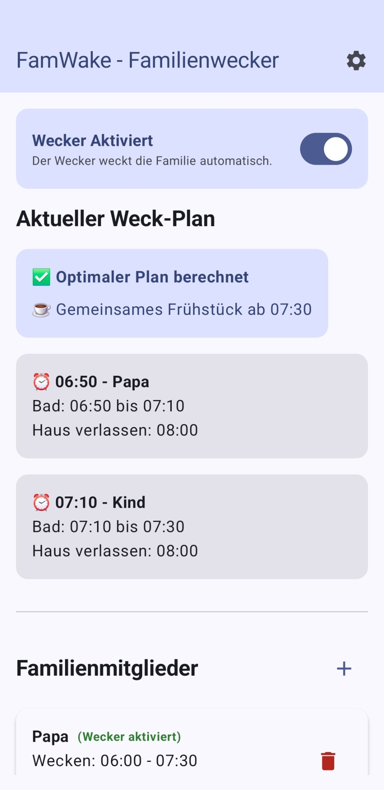
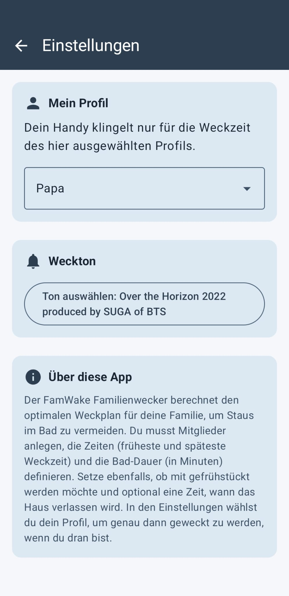
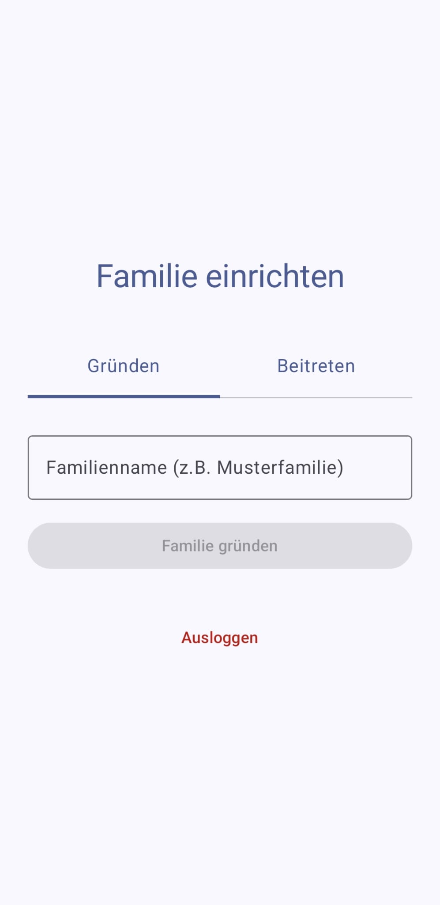

# ⏰ FamWake - Familienwecker / Family Alarm

*[🇬🇧 English version](README.en.md)*

**Jeder schläft länger. Niemand streitet ums Bad. Alle starten entspannt in den Tag.**

Der **FamWake Familienwecker** ist die intelligente Lösung für entspannte Morgenroutinen. Anstatt starrer Weckzeiten passt sich die App dynamisch an die Termine und Bedürfnisse aller Familienmitglieder an. 

👉 **Alle Informationen, Features und die Anmeldung zur Warteliste findest du auf unserer Website:**  
🌐 [www.familienwecker.de](https://www.familienwecker.de)

## 📸 Ein erster Blick in die App

Hier ist ein kleiner Vorgeschmack auf unseren aktuellen Arbeitsstand:

  
  &nbsp;&nbsp;&nbsp;&nbsp;
  
  &nbsp;&nbsp;&nbsp;&nbsp;
  

## ✨ Die Highlights

* **Maximale Schlafzeit:** Ein cleverer Algorithmus berechnet den perfekten Weckplan für die ganze Familie.
* **Kein Bad-Stau:** Nahtlose Übergabe des Badezimmers dank optimierter Taktung.
* **Gemeinsames Frühstück:** Die App findet den idealen Zeitpunkt für alle, die zusammen essen möchten.
* **Wochenend-Schalter:** Einfach den eigenen Wecker pausieren – der Rest der Familie schläft dadurch noch länger aus.
* **"Bin schon wach":** Wecker für heute deaktivieren, ohne den Plan der anderen zu beeinflussen.
* **Sicherer Login:** Einfache Anmeldung via E-Mail oder Google-Konto.

*(Weitere Details zu den Funktionen wie dem smarten Masterplan, der flexiblen Weck-Logik und dem Dark Mode findest du auf unserer [Website](https://www.familienwecker.de).)*

---

## ⚖️ Copyright & License

Copyright (c) 2026 Daniel Notthoff. All rights reserved. 

The source code in this repository is provided for educational and review purposes only. It may not be copied, modified, or distributed without explicit permission from the author.

* [Changelog (Version History)](docs/CHANGELOG.md)
* [Roadmap (Geplante Features)](docs/ROADMAP.md)
* [Datenschutzerklärung (Privacy Policy)](https://www.familienwecker.de/privacy-policy.html)
* [Impressum (Imprint)](https://www.familienwecker.de/imprint.html)
* [Konto & Daten löschen (Account Deletion)](https://www.familienwecker.de/account-deletion.html)
